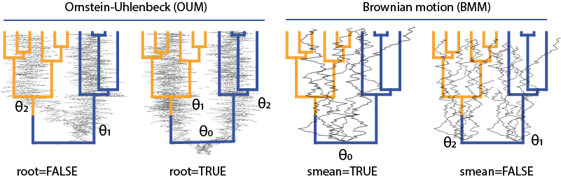
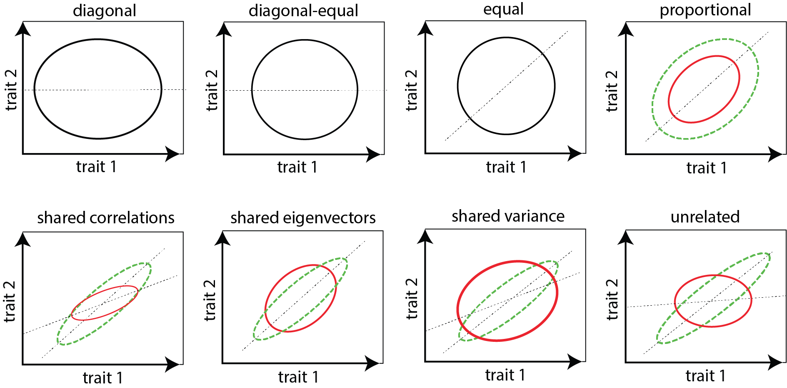

***


Trees and Time series
==

Phylogenetic trees
-
 The trees used by the **mvMORPH** functions must be objects of class "phylo" as provided by the **ape** package. Such trees are directly used with the "EB", "BM1", and "OU1" models (and also with the SHIFT model if the shift age is given in the param list; see ?mvSHIFT).
 To fit models with multiple groups (or selective regimes) such as the "BMM" and "OUM" models (functions _mvBM_ and _mvOU_), the evolutionary history of the selective regimes (i.e., the ancestral state reconstruction - see the next vignette) must be "painted" on the tree. For this purpose **mvMORPH** uses trees in SIMMAP format as provided by the **phytools** package. Several functions allows creating SIMMAP trees:
 
 + _make.simmap_ (Ancestral state reconstruction using stochastic mapping) 
 + _make.era.map_ (Creates temporal map on the tree)
 + _paintBranches_ (Assigns a given discrete state to a particular branch)
 + _paintSubTree_ (Assigns a given discrete state to a particular sub-tree)
 
For instance, a users may be interested in directly using prior knowledge to specify different states on particular parts of the tree (or use results from other ancestral reconstructions methods). The user must refer to the **phytools** documentation for more details.
```{r, results="hide", message=FALSE}
# Load the package and dependencies (ape, phytools, corpcor, subplex)
library(mvMORPH)
```

```{r, comment=">", results="hide"}
# Use a specified random number seed for reproducibility
set.seed(14)
par(mfrow=c(1,3))
tree <- pbtree(n=10)

# Set a different regime to the monophyletic group on node "12"
tree2 <- paintSubTree(tree, node=12, state="group_2", anc.state="group_1")
plot(tree2);nodelabels(,cex=0.8)

# We can set the character state to the stem branch leading to the subtree
tree3 <- paintSubTree(tree, node=12, state="group_2", anc.state="group_1", stem=TRUE)
plot(tree3)

# Finally we can also set a different regime to the branch leading to the tip "t10"
branch_1 <- match("t10",tree3$tip.label) # alternatively: which(tree$tip.label=="t10")
tree4 <- paintBranches(tree3, branch_1, state="group_1")

# set also a change to a third state along the branch 
# leading to "t2" using the "stem" argument
branch_2 <- match("t2",tree3$tip.label) 
tree4 <- paintSubTree(tree4, branch_2, state="group_3", stem=0.5)
plot(tree4)
```

 Note that the tree length can be scaled to unity using the _"scale.height = TRUE"_ option. Why? Scaling the tree will not change the value of the maximum log-likelihood (or AIC), but will change the scale of the parameter estimates. This is particularly useful to compare analyses on different trees or to directly interpret estimates such as the phylogenetic halflife in % of the tree height (see ?_halflife_). Besides, working on scaled trees can sometimes speed up the computations.
 
 
Time series
-

The _mvRWTS_ and _mvOUTS_ functions allow fitting multivariate models of continuous traits evolution with time-series data (such as ancestor-descendent fossil lineages). Such models can be used, for instance, to compare how traits evolve within an ancestor-descendent lineage or between lineages. The times-series must be provided as vectors of ordered ages relative to the starting point (i.e., the oldest, which should be "0").

For instance:
```{r, comment=">"}
# Make a tiny time-series object from fossil ages within [55; 32.5] Ma
fossil_ages <- c(55,46,43,38,35,32.5)

# The time-series becomes:
timeseries <- max(fossil_ages)-fossil_ages
timeseries
```
 
 The _"scale.height=TRUE"_ option will scale the time series between 0 and 1 to provide the relative ages. Similarly to the analysis on phylogenetic trees, this changes the scale of the parameter estimates (such as sigma or alpha) but not the log-likelihood.
 
 
 
# Data and Errors

Matrix or data frame must have species in rows and continuous traits (variables) in columns, rownames must match tip names. Missing cases are currently allowed as **NA** values with the "rpf", "inverse", and "pseudoinverse" methods. The measurement error or sampling variance is a matrix of similar size (note that the sampling variance is given by the square of the standard-errors of species mean estimates). 
Measurement error missing values (**NA** or "0") are allowed. 

For some time-series models (_mvOUTS_ with fixed root vcv and _mvRWTS_; see the "param" list section below) the sampling variance for the first obsevations in the time-series must be provided otherwise an arbitrary value of 0.01 is set automatically to avoid singularity issues.

# Simulating data

The _mvSIM_ function can be used to simulate multivariate (and univariate) datasets.

```{r, comment=">", eval=FALSE}
set.seed(14)
# Generating a random tree with 50 species
tree<-pbtree(n=50)

# Setting the regime states of tip species
sta<-as.vector(c(rep("Forest",20),rep("Savannah",30))); names(sta)<-tree$tip.label

# Making the simmap tree with mapped states
tree<-make.simmap(tree, sta , model="ER", nsim=1)

# Number of simulated datasets
nsim<-1

# Rates matrices for the "Forest" and the "Savannah" regimes
# Note: use lists for multiple rates (matrices or scalars)
sigma<-list(Forest=matrix(c(2,0.5,0.5,1),2), Savannah=matrix(c(5,3,3,4),2))

# ancestral states for each traits
theta<-c(0,0)

# Simulate the "BMM" model
simul_1<-mvSIM(tree, nsim=nsim, model="BMM", param=list(sigma=sigma, theta=theta))

head(simul_1)
```

The _simulate_ function directly generate datasets from estimated parameters of fitted models. This is useful for assessing uncertainty of estimated parameters through parametric bootstrap for instance.

```{r, comment=">", results="hide", eval=FALSE}
# fit the BMM model on simulated data
fit <- mvBM(tree, simul_1)

# simulate 100 datasets from the fitted object
simul_2 <- simulate(fit, tree=tree, nsim=100)

# parametric bootstrap; e.g.:
bootstrap <- lapply(simul_2, function(x) mvBM(tree, x, echo=F, diagnostic=F))

# retrieve results; e.g. for the log-likelihood
log_distribution <- sapply(bootstrap, logLik)

hist(log_distribution, main="Log-likelihood distribution")
abline(v=fit$LogLik, lty=2, lwd=5, col="red")
```
See also the following sections examples.

# Optimization methods

**mvMORPH** rely on the _optim_ and _subplex_ functions to optimize the log-likelihood of the models. The "L-BFGS-B" and "Nelder-Mead" algorithms are used by default for most models. The "L-BFGS-B" algorithm is generally faster and seems to be more efficient, but when the optimizer doesn't converge or if the fit seems unreliable (i.e., when $convergence or the $hess.value in the results are not 0) it may help to switch between these methods or to change the options of these methods in the "control" argument (see ?optim or ?subplex). The _subplex_ algorithm seems particularly efficient for the user-defined models. When the optimization is turned to "fixed" only the log-likelihood function is returned without evaluation (see 9.1 - log-likelihood function section).


# Likelihood computation methods

**mvMORPH** uses various methods based on generalized least squares (GLS) or the prunning algorithm (contrasts) to compute the log-likelihood. 
While GLS-based approaches are very flexible and allow fitting almost all models, to deal with missing cases and measurement errors very easily, and are particularly safe for optimization (e.g., the "pseudoinverse" method), their naive implementations are computationally intensive (e.g., "inverse" and "pseudoinverse" methods). Two alternative and efficient algorithms also based on GLS are proposed ("rpf" and "sparse"). The "sparse" method is both efficient in terms of computational time and memory use, but is limited by the sparsity structure of the variance-covariance (vcv) matrix of the phylogenetic tree while the "rpf" is not. While these approaches are up to ten times faster than the "inverse" or "pseudoinverse" methods, they may suffer from singularity issues during optimization in some cases. 
The "pic" method is the fastest one (thousands of time faster than the GLS-based methods implemented here), but is currently available only for a couple of models and dichotomic trees.

The various methods for each model currently available on mvMORPH (stay tuned on gitHub) are presented in the table below (from the fastest to the slowest)

--------------------------------------------------------------------------------------------------------------------------------------------------
**functions**                _pic_               _sparse_           _univarpf_             _rpf_              _inverse_           _pseudoinv._          
-------------------- -------------------- -------------------- -------------------- -------------------- -------------------- --------------------
_mvBM_:BM1                     X                    X                   -                    X                     X                   X  
 
_mvBM_:BMM                     U                    X                   -                    X                     X                   X         

_mvOU_:OU1                     U                    X                   U                    X                     X                   X

_mvOU_:OUM                     -                    X                   U                    X                     X                   X 

_mvEB_                         X                    X                   -                    X                     X                   X 

_mvSHIFT_                      -                    X                   -                    X                     X                   X 

_mvOUTS_                       -                    -                   -                    X                     X                   X

_mvRWTS_                       -                    -                   -                    X                     X                   X 

**NA** values                  -                    -                   X                    X                     X                   X 

error                          -                    X                   X                    X                     X                   X 
--------------------------------------------------------------------------------------------------------------------------------------------------
Notes: the "sparse" method can be used only with the "fixedRoot" vcv for the "OU1" and "OUM" models. This is because the "randomRoot" vcv is not sparse. This is also the case for the time-serie models.
U = method currently implemented for the univariate case.

# Multivariate GLS models and High-Dimensional datasets

The function _mvgls_ allows estimating multivariate linear models with a time-serie or phylogenetic structure by Generalized Least Square (GLS). This is the multivariate counterpart to the _gls_ function in **nlme** package and the _phylolm_ function in **phylolm** when using _method="LL"_. For the High-dimensional case (where the number of variables/traits _p_ is approaching or is larger than the number of observations/species _n_) a regularization approach by penalized likelihood is used. Several penalties (option _penalty_: "RidgeArch", "RidgeAlt" and "LASSO") can be used to estimate the model parameters by maximizing a cross-validated log-likelihood (option _method_: "LOOCV", "H&L" and "Mahalanobis"). The default method is "LOOCV", the "H&L" and "Mahalanobis" are efficient and approximate methods that can be used to speed up the computations in very high-dimensional cases (but must be used for intercept models only as their performances are decreasing with multiple predictors). As for the _lm_ function, the extractors functions _residuals_, _coef_, _fitted_ and _vcov_ can be used on objects of class "mvgls".


```{r,comment=">"}
set.seed(1)
n <- 32 # number of species
p <- 50 # number of traits (p>n)

tree <- pbtree(n=n, scale=1) # phylogenetic tree
R <- crossprod(matrix(rnorm(p*p), ncol=p)) # a random symmetric matrix (covariance)
# simulate a dataset
Y <- mvSIM(tree, model="BM1", nsim=1, param=list(sigma=R, theta=rep(0,p))) # a BM dataset
data=list(Y=Y)

# High dimensional model fit
fit1 <- mvgls(Y~1, data=data, tree, model="BM", penalty="RidgeArch")
fit2 <- mvgls(Y~1, data=data, tree, model="OU", penalty="RidgeArch")
fit3 <- mvgls(Y~1, data=data, tree, model="EB", penalty="RidgeArch")

GIC(fit1); GIC(fit2); GIC(fit3) # BM have the lowest GIC value (see # Model comparison)

# We can also use the model fit to perform a phylogenetic PCA
# mvgls.pca(fit1)

# Regression model with Pagel's lambda estimation
data=list(Y=Y, X=rnorm(n))
mvgls(Y~X, data=data, tree, model="lambda", penalty="RidgeArch")
```


Note: for the "RidgeArch" and "RidgeAlt" penalizations, various target matrices for the covariance matrix can be specified through the _target_ argument (e.g. target="unitVariance", target="Variance" or target="null" (for RidgeAlt only)). The "Variance" target matrix and the LASSO penalty are not rotation-invariant (and should not be used with geometric morphometric data for instance). See also the _fit_t_pl_ function in **RPANDA** package.


# Model comparison

Models can be compared using Akaike criterions (AIC) and Akaike weights or likelihood ratio test (LRT) when they are nested. Several functions are available on **mvMORPH**: _LRT_, _AIC_, _logLik_, and _aicw_. For models estimated by penalized likelihood (function _mvgls_), a Generalized Information Criterion is computed using the function _GIC_ (see above). Note this criterion has not been tested for comparing models with varying number of fixed effects.

```{r, comment=">", results="hide"}
set.seed(1)
tree <- pbtree(n=50)
# Simulate the traits
sigma<-matrix(c(0.1,0.05,0.05,0.1),2)
theta<-c(0,0)
data<-mvSIM(tree, param=list(sigma=sigma, theta=theta), model="BM1", nsim=1)

# Fit three nested models
fit_1 <- mvBM(tree, data, model="BM1")
fit_2 <- mvBM(tree, data, model="BM1", param=list(constraint="equal"))
fit_3 <- mvBM(tree, data, model="BM1", param=list(constraint="diagonal"))
```
```{r,comment=">"}
# Compare their AIC values
AIC(fit_1); AIC(fit_2); AIC(fit_3)

# Likelihood Ratio Test:
LRT(fit_1, fit_2) # test non-significant as expected!
LRT(fit_1, fit_3)

# Compute the Akaike weights:
results <- list(fit_1,fit_2,fit_3)
weights <- aicw(results)
weights

# Model averaging of the evolutionary covariance
mdavg <- lapply(1:3, function(x) results[[x]]$sigma*weights$aicw[x])
Evol_cov <- Reduce('+',mdavg)
Evol_cov

# Is the model averaging better than the best fitting model in this example?
# which.min(c(mean((sigma-fit_2$sigma)^2),mean((sigma-Evol_cov)^2)))

# Get the evolutionary correlations:
cov2cor(Evol_cov)
# with more than 2 traits you can compute the conditional (or partial) correlations
cor2pcor(Evol_cov)

# Model averaging for the root state
mdavg <- lapply(1:3, function(x) results[[x]]$theta*weights$aicw[x])
Evol_theta <- Reduce('+',mdavg)
```

# Treatment of the root

Ancestral state and primary optimum
-

The "root" argument in the "param" _list_ of the _mvOU_ function allows specifying if the root state and the optimum must be estimated (root=TRUE), unless we assume that the root state and the primary optimum are distributed according to the stationary distribution of the process (root=FALSE; Fig. 1). Indeed, the root state and the primary optimum are not identifiable separately on extant species. A slight variant of root=FALSE is root="stationary" where the root state is explicitely dropped and we assume the optimum is stationary (e.g., the implementation used in the OUwie package).


**Fig. 1.** *Treatment of the root state options in the _mvOU_ and _mvBM_ functions. For the OU process, when root=FALSE the ancestral state at the root is directly derived from the oldest regime state (the ancestral state and the optimum are not estimated separately). With root=TRUE the ancestral state and the optimum are explicitely estimated. It should be noted that the root=TRUE option provides unreliable estimates without fossil data. For the BM model, the smean=TRUE option estimates a single ancestral state (the phylogenetic mean) while smean=FALSE estimates separates phylogenetic means*


```{r,comment=">", message=FALSE, results='hide'}
set.seed(100)
tree<-rtree(100)

# Simulate the traits
alpha<-matrix(c(0.2,0.05,0.05,0.1),2)
sigma<-matrix(c(0.1,0.05,0.05,0.1),2)
theta<-c(0,2,0,1.3)
data<-mvSIM(tree, param=list(sigma=sigma, alpha=alpha, 
                             theta=theta, root=TRUE), model="OU1", nsim=1)
            
mvOU(tree, data, model="OU1", param=list(root=TRUE))
```


For the _mvOUTS_ function, the path from the initial state to the optimum is explicitely estimated (_root=TRUE_, the default value), otherwise the ancestral (initial) state and the optimum are assumed to be the same (_root=FALSE_).

```{r, comment=">", message=FALSE, results='hide'}
# timeseries 
ts <- 0:49
sigma<-matrix(c(0.1,0.05,0.05,0.1),2)
alpha <- matrix(c(1,0.5,0.5,0.8),2,2)
theta<-c(0,2,0,1)
data<-mvSIM(ts, param=list(sigma=sigma, alpha=alpha, 
                             theta=theta, root=TRUE), model="OUTS", nsim=1)

mvOUTS(ts, data, param=list(root=TRUE))
mvOUTS(ts, data, param=list(root=FALSE))
```

Multiple phylogenetic means
-

The "smean" argument in the "param" _list_ of the _mvBM_ function allows estimating either one ancestral state (smean=TRUE) for the whole tree (even if there are multiple regime states) or multiple ancestral states (one for each regimes; smean=FALSE). Note: contrary to the OU model, the reconstructed history of the discrete state doesn't affect the model fit.

When differences between group/regime states are only related to the phylogenetic mean, a multiple rate model can be misleadingly preferred over a single rate model:

```{r,comment=">", results='hide', message=FALSE}
# BM model with two selective regimes
set.seed(1)
tree<-pbtree(n=50)

# Setting the regime states of tip species
sta<-as.vector(c(rep("Forest",20),rep("Savannah",30))); names(sta)<-tree$tip.label

# Making the simmap tree with mapped states
tree<-make.simmap(tree,sta , model="ER", nsim=1)

# Simulate the traits
sigma<-matrix(c(0.1,0.05,0.05,0.1),2)
theta<-c(0,2,0,2)
data<-mvSIM(tree, param=list(sigma=sigma, theta=theta, smean=FALSE), model="BM1", nsim=1)
            
# fit the models with and without multiple phylogenetic mean, and different rates matrix
fit_1 <- mvBM(tree, data, model="BM1")
fit_2 <- mvBM(tree, data, model="BMM")
fit_3 <- mvBM(tree, data, model="BM1", param=list(smean=FALSE))
fit_4 <- mvBM(tree, data, model="BMM", param=list(smean=FALSE))
```

Unless we consider the multiple mean models, the multiple rate matrix is misleadingly preferred ($\Delta$AIC>4) over the single rate matrix (the generating) model.
```{r,comment=">"}
# Compare the fitted models.
results <- list(fit_1,fit_2,fit_3,fit_4)
aicw(results, aicc=TRUE)

```

Directional trends
-

The "trend" argument in the "param" _list_ allows estimating a BM model with a trend (in either _mvBM_ or _mvRWTS_). It should be noted that with _mvBM_, a trend can be estimated reliably only on non-ultrametric trees.

```{r,comment=">", results='hide'}
# Simulated dataset
set.seed(1)
# Generating a random non-ultrametric tree
tree<-rtree(100)

# Simulate the traits
sigma<-matrix(c(0.1,0.05,0.05,0.1),2)
theta<-c(0,0)
trend<-c(0.2,0.2)
data<-mvSIM(tree, param=list(sigma=sigma, trend=trend, theta=theta,
                   names_traits=c("head.size","mouth.size")), model="BM1", nsim=1)

# model without trend
fit_1 <- mvBM(tree, data, param=list(trend=FALSE), model="BM1")
# model with independent trends
fit_2 <- mvBM(tree, data, param=list(trend=TRUE), model="BM1")
# model with similar trend for both traits
fit_3 <- mvBM(tree, data, param=list(trend=c(1,1)), model="BM1") 
```
```{r,comment=">"}
results <- list(fit_1,fit_2,fit_3)
aicw(results)

# are the differences between trends significant?
LRT(fit_2,fit_3) # No... as expected
```

In the same way we can fit a directional random walk on time-series data.

```{r,comment=">", results='hide', message=FALSE}
# Simulate the time serie and data
timeseries  <- 0:49
error <- matrix(0, nrow=50, ncol=2); error[1,] <- 0.001
data<-mvSIM(timeseries , error=error, model="RWTS", 
            param=list(sigma=sigma, theta=theta, trend=trend), nsim=1)

# plot the time serie
matplot(data, type="o", pch=1, xlab="Time (relative)")

# model fit
fit1 <- mvRWTS(timeseries , data, error)
fit2 <- mvRWTS(timeseries , data, error, param=list(trend=c(1,1)))
```{r, comment=">"}
LRT(fit2,fit1)
```

Note that the theta parameters cannot be estimated analytically for the "trend" model (i.e., option root.mle=TRUE in the returned log-likelihood function)


# Constraints

Overview of the various constraint parameterizations in **mvMORPH**
-

Comparison of constrained models allows testing various evolutionary hypotheses such as independent evolution, comparing evolutionary rates between traits, common structure, phenotypic integration, ... etc. The constraint methods currently available on mvMORPH are the following (see also Fig. 2):



**Fig. 2.** *Bivariate representation of the covariance constraints used in mvMORPH.*


 + **"default"**: no constraint imposed on the structure of the rate (evolutionary variance and covariance) matrix
 + **"diagonal"**: there are no evolutionary covariance between traits $\rightarrow$ the rate matrix is diagonal.
 + **"equaldiagonal"**: there are no evolutionary covariance and the traits share the same variance.
 + **"equal"**: the traits covaries and share the same variance (or evolutionary rate).
 + **"proportional"** (only with "BMM"): the rate matrices are proportional for different regimes/states mapped on the tree. 
 + **"correlation"** (only with "BMM"): the rate matrices share the same correlations between traits for different regimes/states mapped on the tree.
 + **"variance"** (only with "BMM"): the rate matrices share the same variances (rates) between regimes/states mapped on the tree.
 + **"shared"** (only with "BMM"): the rate matrices share the same eigen-vectors (orientations) between regimes/states mapped on the tree.
 + **"user"**: the design of the rate matrix is directly defined by the user. Note that for 2 traits, all the combinations are readily available from the default methods. See example below.
 
"User-defined" constraints
-

**User-defined** constraints are done by providing a symmetric square matrix with integer values taken as indices of the parameters. To constrain covariance values to zero, the user must use **NA** values as indices. Because a covariance matrix must be symmetric positive definite, negative eigenvalues are automatically shrunk to a specified tolerance value (=1). This value can be changed through the "param" _list_ with the "tol" argument. This value must be changed with various estimates (e.g. 1e-5, 10...) if convergence of the optimizer has not been achieved. The alternative optimization methods may help. __The "subplex" optimization method is advised__.

```{r, results="hide", comment=">", message=FALSE}
set.seed(14)
# Generating a random tree
tree<-pbtree(n=50)

# Simulate 3 traits
sigma <- matrix(c(0.01,0.005,0.003,0.005,0.01,0.003,0.003,0.003,0.01),3)
theta<-c(0,0,0)
data<-mvSIM(tree, model="BM1", nsim=1, param=list(sigma=sigma, theta=theta))

# Fit user-defined contrained model
user_const <- matrix(c(1,4,4,4,2,5,4,5,3),3)
fit1 <- mvBM(tree, data, model="BM1", method="pic"
             , param=list(constraint=user_const), optimization="subplex")

# only rates/variances are changing
user_const <- matrix(c(1,3,3,3,2,3,3,3,2),3)
fit2 <- mvBM(tree, data, model="BM1", param=list(constraint=user_const)
             , method="pic", optimization="subplex")
```
```{r,comment=">"}
# Some covariances constrained to zero
user_const <- matrix(c(1,4,4,4,2,NA,4,NA,3),3)

print(user_const)

fit3 <- mvBM(tree, data, model="BM1", method="pic"
             , param=list(constraint=user_const), optimization="subplex")

```

Note: the user-defined option can also be used with the _decomp_ or _decompSigma_ argument for the OU processes (see below). The diagonal elements are automatically squared to obtain positive definite matrices or positive eigenvalues.


# The "param" list 

The "param" _list_ argument allows specifying multiple options in **mvMORPH** functions (starting value estimate for the optimization, constraints, matrix parameterization...)

## The "decomp" and "decompSigma" options

These options allow specifying the matrix parameterization used for the alpha (A) and dispersion (R) ($R=\Sigma^T\Sigma$) matrices of parameters for the Ornstein-Uhlenbeck process:
$$dX(t)=A(\theta(t) - X(t))dt + \Sigma dW(t)$$
and Brownian motion:
$$ dX(t)=\Sigma dW(t) $$

For symmetric matrices (e.g., the variance-covariance matrix of the multivariate Brownian motion $R =\Sigma^T\Sigma$), **mvMORPH** uses various parameterizations to ensure the positive definiteness such as _decomp="cholesky"_, _decomp="spherical"_ or _decomp="eigen+"_. The _decomp="eigen"_ option parameterizes a symmetric matrix. For the _mvOU_ function, the sigma matrix parameterization is controlled by the _decompSigma_ argument; e.g., _decompSigma="cholesky"_. 

Symmetric matrices are parameterized by _p(p+1)/2_ parameters. The first _p(p-1)/2_ parameters are used to compute the cholesky factors of spherical angles, or the orthogonal matrices; the next _p_ parameters are the eigenvalues (in "eigen") or the standard deviations (in "spherical"). The bivariate case is illustrated here:


**Cholesky decomposition**: _decomp="cholesky"_
$$
R/A=
\begin{bmatrix} l_{11} &  0 \\  l_{21} &  l_{22} \end{bmatrix}
\begin{bmatrix} l_{11} &  0 \\  l_{21} & l_{22} \end{bmatrix}^T
$$

**Separation strategy**: _decomp="spherical"_ 
$$
R/A=
\begin{bmatrix} \sqrt{\nu_1} &  0 \\  0 &  \sqrt{\nu_2} \end{bmatrix}
\begin{pmatrix}
\begin{bmatrix} 1 & \cos(\theta_1) \\ 0 &  \sin(\theta_1) \end{bmatrix}^T
\begin{bmatrix} 1 & \cos(\theta_1) \\  0 &  \sin(\theta_1) \end{bmatrix}
\end{pmatrix}
\begin{bmatrix} \sqrt{\nu_1} &  0 \\  0 &  \sqrt{\nu_2} \end{bmatrix}
$$

**Eigen decomposition**: _decomp="eigen"_
$$
R/A=
\begin{bmatrix} \cos(\theta_1) &  -\sin(\theta_1) \\  \sin(\theta_1) &  \cos(\theta_1) \end{bmatrix}
\begin{bmatrix} \lambda_1  & 0 \\  0 &  \lambda_2 \end{bmatrix}
\begin{bmatrix} \cos(\theta_1) &  -\sin(\theta_1) \\ \sin(\theta_1) &  \cos(\theta_1) \end{bmatrix}^T
$$

or to force the eigenvalues to be positive (mandatory for the sigma matrix):

$$
R/A=
\begin{bmatrix} \cos(\theta_1) &  -\sin(\theta_1) \\  \sin(\theta_1) &  \cos(\theta_1) \end{bmatrix}
\begin{bmatrix} \log{(\lambda_1)}  & 0 \\  0 &  \log{(\lambda_2)} \end{bmatrix}
\begin{bmatrix} \cos(\theta_1) &  -\sin(\theta_1) \\ \sin(\theta_1) &  \cos(\theta_1) \end{bmatrix}^T
$$

For the OU process, the alpha matrix can be more general. Matrix parameterization such as singular value decomposition (_decomp="svd"_), QR (_decomp="qr"_), or Schur decomposition (_decomp="schur"_) are nevertheless used to generate decomposable and real matrices. The _decomp="svd+"_, _decomp="qr+"_, and _decomp="schur+"_ options forces the eigenvalues to be positive by taking their logarithm, and ensure uniqueness for the QR factorization. These matrices are parameterized by $p^2$ parameters. The first _p(p-1)/2_ parameters are used to compute the first orthogonal matrix, while the next _p_ parameters are used for the eigenvalues ("svd") or diagonal values of the upper triangular matrix ("qr" and "schur"). The last _p(p-1)/2_ parameters are used to compute the second othogonal matrix ("svd"), or to fill the upper off-diagonal of the triangular matrix in the "schur" and "qr" parameterizations.


**Singular Value Decomposition (SVD)**: _decomp="svd"_
$$
A=
\begin{bmatrix} \cos(\theta_1)  & -\sin(\theta_1) \\ \sin(\theta_1) &  \cos(\theta_1) \end{bmatrix}
\begin{bmatrix} \lambda_1  & 0 \\  0 & \lambda_2 \end{bmatrix}
\begin{bmatrix} \cos(\theta_2) &  -\sin(\theta_2) \\ \sin(\theta_2) & \cos(\theta_2) \end{bmatrix}^T
$$

**QR decomposition**: _decomp="qr"_
$$
A=
\begin{bmatrix} \cos(\theta_1) & -\sin(\theta_1) \\ \sin(\theta_1) & \cos(\theta_1) \end{bmatrix}
\begin{bmatrix} \lambda_1 & \theta_2 \\ 0 & \lambda_2 \end{bmatrix}
$$

**Schur decomposition**: _decomp="Schur"_
$$
A=
\begin{bmatrix} \cos(\theta_1) & -\sin(\theta_1) \\ \sin(\theta_1) & \cos(\theta_1) \end{bmatrix}
\begin{bmatrix} \lambda_1 & \theta_2 \\  0 &  \lambda_2 \end{bmatrix}
\begin{bmatrix} \cos(\theta_1) & -\sin(\theta_1) \\ \sin(\theta_1) & \cos(\theta_1) \end{bmatrix}^T
$$


Finally, the alpha matrix can be diagonal (independent effects) or triangular. Triangular parameterizations are for instance used on time-series forecasting to determine if a given variable is helpful in predicting a second one (the so-called Granger causality; e.g., the lower process drives the upper one for an upper triangular matrix). Similarly to symmetric matrices, upper and lower triangular matrices are parameterized by _p(p+1)/2_ parameters. The first _p(p-1)/2_ parameters are used for the upper or lower off-diagonal of the matrices, while the next _p_ parameters are in the diagonal.


**Diagonal**: _decomp="diagonal"_
$$
R/A=
\begin{bmatrix} \sqrt{d_{11}} &  0 \\  0 & \sqrt{d_{22}} \end{bmatrix}
\begin{bmatrix} \sqrt{d_{11}} &  0 \\  0 & \sqrt{d_{22}} \end{bmatrix}^T
$$

**Upper triangular**: _decomp="upper"_
$$
A=
\begin{bmatrix} \log{(d_{11})} & u_{12} \\  0 & \log{(d_{22})} \end{bmatrix}
$$

**Lower triangular**: _decomp="lower"_
$$
A=
\begin{bmatrix} \log{(d_{11})} & 0 \\ l_{21} & \log{(d_{22})} \end{bmatrix}
$$

_Note: so far, the package can't handle matrices with similar eigenvalues (e.g., the diagonal values must be slightly different in a triangular matrix)._

Non-symmetric matrices can be used to test, for example, hypotheses of evolutionary lag (see chunk of code below). That is, one trait is chasing the optimum of the second one with a sufficient lag to be detected (a triangular matrix), while if the tracking is fast enough a "symmetric" model will be preferred. It should be noted that on ultrametric trees it's difficult to estimate accurately the path from the ancestral state toward the primary optimum and therefore it's hard to test such kind of process with the "OU1" model. For the "OUM" model on ultrametric trees, the path from the first optimum to the other one between traits is compared, which makes the model identifiable.

```{r, comment=">", results='hide'}
set.seed(14)
tree <- rtree(50)
alpha<-matrix(c(0.6,0,-0.6,0.3),2)
sigma<-matrix(c(0.01,0.005,0.005,0.01),2)
theta <- matrix(c(0,1,0,1.3),2)
# Simulate two correlated traits evolving along the phylogeny
# e.g. brain size is lagging behind body-size
# as in Deaner & Nunn 1999 - PRSB
data<-mvSIM(tree,nsim=1, model="OU1",
            param=list(sigma=sigma, alpha=alpha, theta=theta, root=TRUE, 
                       names_traits=c("brain-size","body-size")))

# No detectable lag:
fit_1 <- mvOU(tree, data, model="OU1", param=list(root=TRUE))
# Brain size lag behind body size (the simulated model!)
fit_2 <- mvOU(tree, data, model="OU1", param=list(decomp="upper", root=TRUE)) 
# Body size lag behind brain-size
fit_3 <- mvOU(tree, data, model="OU1", param=list(decomp="lower", root=TRUE))
```
```{r, comment=">"}
results <- list(fit_1, fit_2, fit_3)
aicw(results)
```


User-defined constraints on the matrix parameterizations are allowed (but user should check convergence and try with different methods; see the "constraints" section above):
```{r,comment=">"}
# try user defined constraints
set.seed(100)
ts <- 50
timeseries  <- 0:ts

sigma <- matrix(c(0.01,0.005,0.003,0.005,0.01,0.003,0.003,0.003,0.01),3)
# upper triangular matrix with effect of trait 2 on trait 1.
alpha <- matrix(c(0.4,0,0,-0.5,0.3,0,0,0,0.2),3,3) 
theta <- matrix(c(0,0,0,1,0.5,0.5),byrow=T, ncol=3); root=TRUE

data <- mvSIM(timeseries , model="OUTS", param=list(alpha=alpha, 
              sigma=sigma, theta=theta, root=root, 
              names_traits=c("sp 1", "sp 2", "sp 3")))

# plot
matplot(data, type="o", pch=1, xlab="Time (relative)")
legend("bottomright", inset=.05, legend=colnames(data), pch=19, col=c(1,2,3), horiz=TRUE)
```

Then provide a matrix of integer indices specifying the target structure:

```{r, comment=">", results="hide", message=FALSE, eval=FALSE}
# define an user constrained drift matrix
indice <- matrix(NA,3,3)
diag(indice) <- c(1,2,3)
indice[1,2] <- 4

# fit the models
fit_1 <- mvOUTS(timeseries , data, param=list(vcv="fixedRoot", decomp=indice))
fit_2 <- mvOUTS(timeseries , data, param=list(vcv="fixedRoot", decomp="diagonal"))

LRT(fit_1, fit_2)
```


## the "vcv" argument

For the Ornstein-Uhlenbeck process (OU), the variance-covariance matrix (vcv) is conditioned depending on how the root is treated. The _vcv="randomRoot"_ option assumes that the root is a random variable with the distribution of the stationary process; the _vcv="fixedRoot"_ option assumes that the root state is a fixed parameter. While the computation of the "randomRoot" variance-covariance is faster, we cannot use it with the _method="sparse"_ option to compute the log-likelihood. However when the process is stationary (i.e., when the alpha value/eigenvalues are large enough) both approaches should converge to the same results:

```{r, comment=">", results='hide'}
set.seed(1)
# simulate a tree scaled to unit length
tree <- pbtree(n=100, scale=1)

theta <- c(0,2) # the ancestral state and the optimum
sigma <- 1
alpha <- 0.1 # large half-life
trait <- mvSIM(tree, nsim=1, model="OU1", 
               param=list(theta=theta, sigma=sigma, alpha=alpha, root=TRUE))

# fit the models
fit_1 <- mvOU(tree, trait, model="OU1", param=list(vcv="randomRoot"))
fit_2 <- mvOU(tree, trait, model="OU1", param=list(vcv="fixedRoot"))

# Simulate with a stronger effect
alpha <- 6 # small half-life ~10% of the tree height
trait <- mvSIM(tree, nsim=1, model="OU1", 
               param=list(theta=theta, sigma=sigma, alpha=alpha, root=TRUE))

# fit the models
fit_3 <- mvOU(tree, trait, model="OU1", param=list(vcv="randomRoot"))
fit_4 <- mvOU(tree, trait, model="OU1", param=list(vcv="fixedRoot"))

```{r, comment=">"}
# compare the log-likelihood
abs(logLik(fit_1))-abs(logLik(fit_2)) # large half-life
abs(logLik(fit_3))-abs(logLik(fit_4)) # small half-life

```

Note: when the strength of selection is high the theta/alpha estimates may be aberrant when using the "fixedRoot" option, particularly on ultrametric trees.


# Functions

The loglikelihood function
-

The log-likelihood function evaluated during the model fit can be accessed on objects of class "mvmorph" with the _$llik()_ expression.

```{r, comment=">", results="hide"}
set.seed(1)
tree <- pbtree(n=50)
# Simulate the traits
sigma<-matrix(c(0.1,0.05,0.05,0.1),2)
theta<-c(0,0)
data<-mvSIM(tree, param=list(sigma=sigma, theta=theta), model="BM1", nsim=1)

# Fit the model
fit <- mvBM(tree, data, model="BM1")
```
```{r, comment=">", results="hide"}
# the loglik function (the order of parameter is printed:)
fit$llik
```
```{r, comment=">"}
# Use the maximum likelihood parameters from the optimizer
par <- fit$param$opt$par
fit$llik(par)

all.equal(fit$llik(par),logLik(fit)) # similar results

# Return also the analytic MLE for theta
fit$llik(par, theta=TRUE)
```
 
On all **mvMORPH** models, the ancestral states (optimum or theta) are the maximum likelihood estimate (mle) analytic solutions (conditioned on the other parameters). Nevertheless, the user can specify manually the values for the root state (e.g., for mcmc evaluation):

```{r, comment=">"}
# Use the maximum likelihood parameters from the optimizer
fit$llik(c(par,fit$theta), root.mle=FALSE)

```

The matrix parameterization functions
-

The model object also returns functions in the "param" _list_. The _sigmafun_ and _alphafun_ functions return the parameterization functions used to fit the models (see the "parameterization" section).

```{r, comment=">"}
# Reconstruct sigma with the untransformed values of the optimizer
sigma <- fit$param$sigmafun(par)

all.equal(as.vector(sigma), as.vector(fit$sigma))
```

Note that all these functions are available without maximum likelihood evaluation by using the "fixed" optimization option.

```{r, comment=">"}
# Return the log-likelihood function only
fit <- mvBM(tree, data, model="BM1", optimization="fixed")

```


# Fossil data

All the functions in **mvMORPH** can handle datasets with fossil species, either from time-series or phylogenetic trees. Fossil data added
to extant ones in non-ultrametric trees frequently greatly improve the reliability and accuracy of parameter estimates and are mandatory for detecting changes in evolutionary modes such as with the _mvSHIFT_ model or with _mvBM_ and _mvRWTS_ with "trend". See also "treatment of the root state" above.

Overview of the functions
--

Methods specifically dedicated to work with fossil data:

  +  _mvSHIFT_ models
  +  _mvBM_ param=list(trend=TRUE)
  +  _mvOU_ param=list(root=TRUE)
  +  _mvOUTS_ multivariate OU for time-series (coevolution, causal links...)
  +  _mvRWTS_ multivariate random walk (=BM process) for time series
  +  _mvRWTS_ param=list(trend=TRUE) directional random walk

Imputing missing values
--

Fossil remains are often altered by post-mortem taphonomic processes such as weathering or distortion. The _estim_ function can be used to estimate missing phenotypic values for incomplete fossil specimens according to an evolutionary model.


```{r, results='hide'}
# Simulated dataset
set.seed(14)
# Generating a random tree
tree<-rtree(50)

# Simulate two correlated traits evolving along the phylogeny
sigma<-matrix(c(0.1,0.05,0.05,0.1),2); theta<-c(0,2)
traits<-mvSIM(tree, model="BM1", param=list(sigma=sigma, theta=theta))

# Introduce some missing cases (NA values)
data<-traits
data[8,2]<-NA
data[25,1]<-NA

# Fit of model 1
fit_1<-mvBM(tree,data,model="BM1")
```{r, comment=">"}
# Estimate the missing cases
imp<-estim(tree, data, fit_1, asr=FALSE)

# Check the imputed data
imp$estim[1:10,]
```

Ancestral state reconstructions
--

Note that if the _asr_ argument is TRUE, the ancestral states at each node are returned instead of the imputed values. If there is missing cases in the dataset, they are first imputed before estimating the ancestral values.

```{r, comment=">"}
plot(tree, cex=0.6)
nodelabels(, cex=0.6)

# Estimate the ancestral states
asr<-estim(tree, data, fit_1, asr=TRUE)
asr$estim[1:10,]
```


# Tweak mvMORPH

We can use the returned log-likelihood of the mvMORPH functions, or the _mvLL_ function to fit user-defined models. Here we show two simple examples of how the architecture of the package can be used.

Make your own model!
-

```{r,comment=">"}
set.seed(123)
# Here I show a simple example of model fitting using mvMORPH
tree <- pbtree(n=100)

# 1) Create a model, e.g. the Kappa model of Pagel 1999
phylo_kappa <- function(tree, kappa){
  tree$edge.length <- tree$edge.length ^ kappa
  return(tree)
}

# just to compare the trees
par(mfrow=c(1,2))
plot(tree, show.tip.label=FALSE, main="untransformed tree")
plot(phylo_kappa(tree, 0.5), show.tip.label=FALSE, main="Kappa model")

# 2) Create the log-likelihood function

log_lik <- function(par, tree, data){
  tree_transf <- phylo_kappa(tree, par)
  result <- mvLL(tree_transf, data, method="pic")
  return(list(logl=result$logl, theta=result$theta, sigma=result$sigma))
}

# 3) optimize it!

# create fake data
trait <- rTraitCont(phylo_kappa(tree, 0.7))

# guess for the optimization
guess_value <- 0.5

# optimize the model!
fit <- optim(guess_value, function(par){log_lik(par, tree, trait)$logl},
             method="L-BFGS-B", lower=0, upper=1, control=list(fnscale=-1))

result <- data.frame(logLik=fit$value, kappa=fit$par, sigma2=log_lik(fit$par, tree,
                              trait)$sigma, theta=log_lik(fit$par, tree, trait)$theta )
rownames(result) <- "Model fit"

# print the result
print(result)


# Do the same for a multivariate model:
# simulate traits independently
trait <-cbind( rTraitCont(phylo_kappa(tree, 0.7)), rTraitCont(phylo_kappa(tree, 0.7)))

log_lik <- function(par, tree, data){
  # transform the tree for each traits
  tree_transf <- list(phylo_kappa(tree, par[1]), phylo_kappa(tree, par[2]))
  result <- mvLL(tree_transf, data, method="pic")
  return(list(logl=result$logl, theta=result$theta, sigma=result$sigma))
}

# fit
guess_value <- c(0.5,0.5)
fit <- optim(guess_value, function(par){log_lik(par, tree, trait)$logl},
             method="L-BFGS-B", lower=0, upper=1, control=list(fnscale=-1))

result <- list(logLik=fit$value, kappa=fit$par, sigma2=log_lik(fit$par, tree,
                              trait)$sigma, theta=log_lik(fit$par, tree, trait)$theta)
# as expected the covariances are low
print(result)
```

Reuse of the returned log-likelihood functions
-

We can also use the likelihood returned by the mvMORPH functions to fit custom models using joint optimizations. Here is an example with time-series data to fit a shift in rates and covariances.

```{r,comment=">"}
set.seed(123)
# Simulate the time serie
timeseries <- 0:99

# Simulate the traits
sigma_1 <- matrix(c(0.015,0.005,0.005,0.01),2)
sigma_2 <- matrix(c(0.03,0.01,0.01,0.02),2)
theta <- c(0.5,1)
error <- matrix(0,ncol=2,nrow=100);error[1,]=0.001
data_1<-mvSIM(timeseries , error=error, 
              param=list(sigma=sigma_1, theta=theta), model="RWTS", nsim=1)
data_2<-mvSIM(timeseries +100, error=error,
              param=list(sigma=sigma_2, theta=data_1[100,]), model="RWTS", nsim=1)
data <- rbind(data_1,data_2)

# plot the time serie
matplot(data, type="o", pch=1, xlab="Time (relative)", cex=0.8)

# 1) log-likelihood function
fun_ts_1 <- mvRWTS(timeseries , data_1, error=error, optimization="fixed")
fun_ts_2 <- mvRWTS(timeseries +100, data_2, error=error, optimization="fixed")

# a model of shift
log_lik_RWshift <- function(par){
  # compute the log-likelihood for the first bin
  part1 <- fun_ts_1$llik(par[1:3], theta=TRUE)
  # compute the log-likelihood for the second bin using the 
  # expectation of the first bin and sigma2
  part2 <- fun_ts_2$llik(c(par[4:6],part1$theta), root.mle=FALSE)
  
  # the log-likelihood
  ll1 <- part1$logl; ll2 <- part2
  return(ll1+ll2)
}

# 2) starting values (only for sigma because theta is computed analytically)
guess_value <- c(chol(sigma_1)[upper.tri(sigma_1, diag=TRUE)], 
                 chol(sigma_2)[upper.tri(sigma_2, diag=TRUE)])

# optimize the model!
fit <- optim(guess_value, function(par){log_lik_RWshift(par)},
             method="Nelder-Mead", control=list(fnscale=-1))

# plot the results
results <- list(sigma_1=fun_ts_1$param$sigmafun(fit$par[1:3]), 
                sigma_2=fun_ts_2$param$sigmafun(fit$par[4:6]), 
                theta=fun_ts_1$llik(fit$par[1:3], theta=TRUE)$theta,
                llik=fit$value)
print(results)


```


# Bayesian mcmc

**mvMORPH** models can be estimated using Bayesian mcmc. For instance we can use weakly informative priors using the various parameterizations in **mvMORPH**, or directly put priors on the final parameters (e.g., the inverse Wishart for the rate matrix sigma). Here is an example using the separation strategy based on the spherical parameterization (angles in the interval [0, $\pi$] to ensure the uniqueness of the spherical parameterization; and standard deviations expressed as uniform priors on [1e-5, 0.4] (but half-t or inverse Gamma should be preferred); see for instance Lu & Ades 2009; and the matrix parameterization section above).

```{r, comment=">", results="hide", eval=FALSE}
set.seed(1)
tree <- pbtree(n=50)
# Simulate the traits
sigma<-matrix(c(0.1,0.05,0.05,0.1),2)
theta<-c(0,0)
data<-mvSIM(tree, param=list(sigma=sigma, theta=theta), model="BM1", nsim=1)

# Retrieve the log-likelihood of the model (we can use optimization="fixed")
bm_model <- mvBM(tree, data, model="BM1", method="pic")

# define weakly informative prior for the correlations and standard deviations separately
prior <- function(x){
  a <- dunif(x[1],min=0, max=pi, TRUE) # prior for the angles
  b <- dunif(x[2],min=1e-5, max=0.4, TRUE) # prior for the standard deviations of trait 1
  c <- dunif(x[3],min=1e-5, max=0.4, TRUE) # prior for the standard deviations of trait 2
  return(a+b+c)
}

# define the log-likelihood distribution
log_lik <- function(par){
  ll <- bm_model$llik(par)
  pr <- prior(par)
  return(ll+pr)
}

# Use an mcmc sampler
require(spBayes)
require(coda)
start_val <- bm_model$param$opt$par #the ML values
n.batch <- 500
l.batch <- 25

# run the mcmc
fit <- adaptMetropGibbs(log_lik, starting=start_val, batch=n.batch, batch.length=l.batch)

# plot the results
chain <- mcmc(fit$p.theta.samples)
plot(chain)

# check the distribution of the transformed values
rate_matrix <- t(apply(fit$p.theta.samples, 1, bm_model$param$sigmafun))
colnames(rate_matrix) <- c("Sigma [1,1]","Sigma [1,2]","Sigma [2,1]","Sigma [2,2]")
chain2 <- mcmc(rate_matrix)
plot(chain2)
```