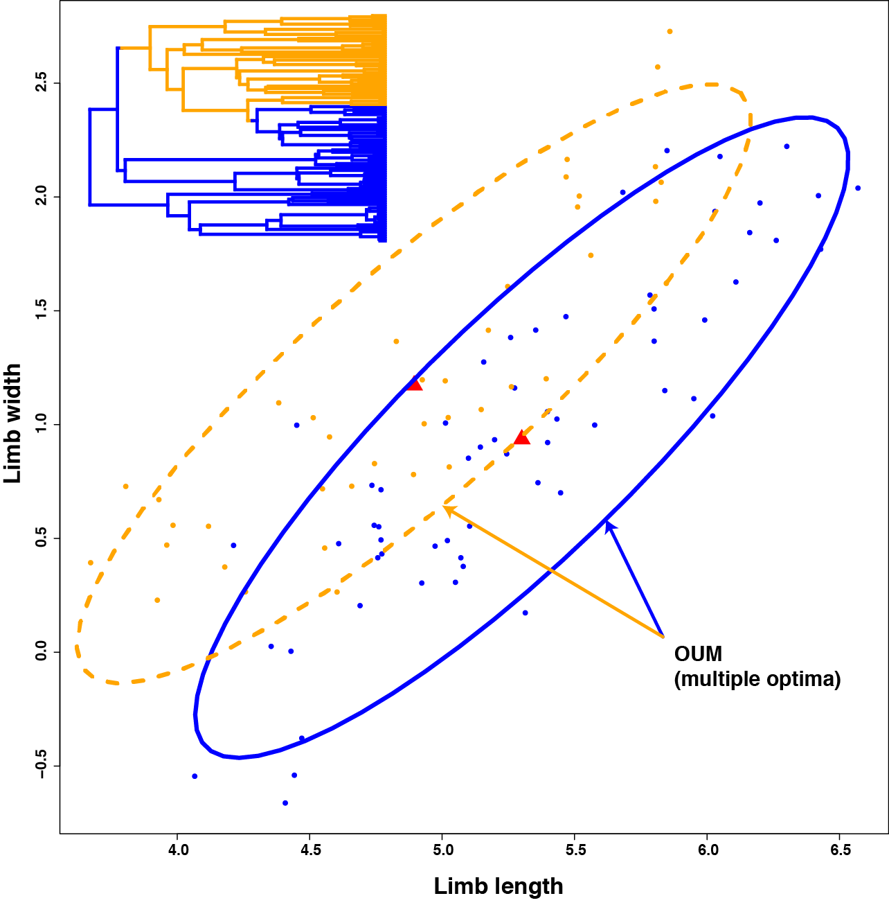
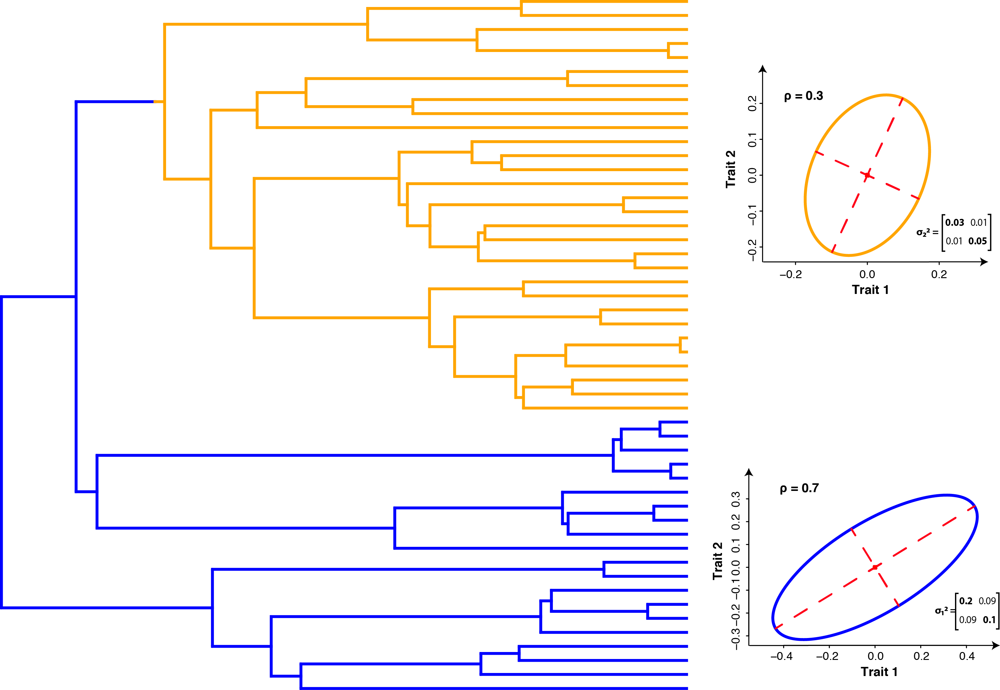

***

To illustrate how **mvMORPH** works, we describe and comment below two simulated examples. These examples are deliberately simple in order to show how the package works; therefore they are not directly related to any real biological context, although we will use names of known environments in order to make the understanding of objectives and results easier.

In the first example, we show how the package works in the classic situation of testing evolution towards two distinct selective regimes (Fig. 1). We simulate two correlated continuous traits evolving according to an Ornstein-Uhlenbeck (OU) process with two optima along the tree. We then fit an OU multivariate model with one (OU1) or two optima (OUM), and we compare the results with those obtained from separate univariate analyses on each simulated trait. This example is intended to show how covariations between traits can blur differences in optima that are not detected using a set of univariate analyses. In this specific case, we further show differences in type I and type II errors under univariate and multivariate settings; we also illustrate how to compare for significant interactions between traits in the path toward the optima.

In the second worked example, we compare the structure of evolutionary covariances in two, ecologically distinct species group using a nested hierarchy of tests thanks to the different rate matrix parameterizations proposed in **mvMORPH**. Such an approach is particularly useful to assess statistically how evolutionary covariations differ between groups of species. Indeed, we can expect various covariance structures depending on the selective pressures acting, e.g., on different ecological groups (e.g., low covariances for phenotypically diversified species when compared to more specialized ones, same directions of trait covariances, common structure…).

Note that the help pages of the **mvMORPH** package (accessible through the question mark argument in the R console; e.g., ?mvBM) also provide simulated examples illustrating how the various functions work.

## Example 1: Models with distinct selective regimes
  We first load the package and its dependencies, and initialize the random number generator:


```{r, comment=">"}
# Load the package and dependencies (ape, phytools, corpcor, subplex, spam)
library(mvMORPH)
# Use a specified random number seed for reproducibility
set.seed(14)

```

Then we simulate a random pure-birth tree with 100 taxa using the phytools package:

```{r}
tree<-pbtree(n=100)
```

In this example, we are interested in evaluating the optima of two species groups (one optimum per species group) experiencing different environments. We first map on the tree the location of each regime (Fig. 1), and then simulate traits according to a multivariate OU process with two slightly distinct optima. For the sake of illustration, we hypothesize that the two selective regimes in this case are two well-known environments found in Africa: Savannah and Tropical Evergreen Forest. In real case studies, we may expect, e.g., that morpho-functional traits found in species occurring in each environment display differences in evolutionary rates, or adaptation toward distinct optima due to distinct selective pressures.

We use stochastic character mapping of discrete traits (SIMMAP; Huelsenbeck et al. 2003; Bollback 2006) as proposed by the make.simmap function from **phytools** for mapping the selective regimes:

```{r, comment=">"}
# Simulate two selective regimes
state<-as.vector(c(rep("Forest",60),rep("Savannah",40))); names(state)<-tree$tip.label

# Make the tree with mapped states using SIMMAP
tree<-make.simmap(tree, state, model="ER", nsim=1)

```


**Figure 1.** *Simulated correlated traits under a multi-optimum OU process (function “mvSIM”). The tree was simulated according to a pure-birth process with 100 taxa and two selective regimes representing hypothesized “Savannah” and “Tropical Evergreen Forest” environments mapped on. The mapping is done using the “make.simmap” function from the phytools package, and is used as an input tree by the mvMORPH functions.*

The resulting tree can be plotted with the mapped selective regimes as displayed in Fig. 1 for illustrative purpose:

```{r, comment=">"}
# Plot the phylogeny with the mapped discrete trait
col<-c("blue","orange"); names(col)<-c("Forest","Savannah")
plotSimmap(tree,col, fsize=0.6, node.numbers=FALSE, lwd=3, pts=FALSE)

```

Then we simulate the evolution of a multivariate Ornstein-Uhlenbeck process with two optima on the tree. In order to illustrate the problem shown in Fig. 1 of the main text, we choose here a configuration where the leading eigenvector is oriented at ~45° in the bivariate space of the two evolving traits:

```{r, comment=">"}
# 2 Random traits evolving along the phylogeny as a two-optimum OU
set.seed(101)

alpha<-matrix(c(1.1,-0.9,-0.9,1),2)
sigma<-matrix(c(0.35,0.06,0.06,0.35),2)
theta<-c(5.5,5.1,1.2,1.4)
data<-mvSIM(tree, param=list(sigma=sigma, alpha=alpha, ntraits=2, mu=theta, 
names_traits=c("limb.length","limb.width")), model="OUM", nsim=1)

```

We now fit a single optimum and a multiple optimum Ornstein-Uhlenbeck process to each trait separately (i.e., univariate analysis), and then a single and a multiple OU process to both traits analyzed simultaneously (i.e., multivariate analysis):

```{r, comment=">"}
# Fitting the Ornstein Uhlenbeck on the whole tree 
trait1_OU1<- mvOU(tree, data[,1], model="OU1", diagnostic=FALSE, echo=FALSE)
trait2_OU1<- mvOU(tree, data[,2], model="OU1", diagnostic=FALSE, echo=FALSE)
# Fitting the Ornstein Uhlenbeck with multiple optimums 
trait1_OUM<- mvOU(tree, data[,1], model="OUM", diagnostic=FALSE, echo=FALSE)
trait2_OUM<- mvOU(tree, data[,2], model="OUM", diagnostic=FALSE, echo=FALSE)

# Compare the AIC values between models fit
AIC(trait1_OUM); AIC(trait1_OU1)
AIC(trait2_OUM); AIC(trait2_OU1)

# Now compare with the multivariate fit
OUM<- mvOU(tree, data, model="OUM")
OU1<- mvOU(tree, data, model="OU1")
AIC(OUM); AIC(OU1)

```

After model fitting, we extract their related AIC or AICc using the expression “$AIC” or with the AIC() generic method. Despite of the low number of parameters to estimate in the univariate analysis (3 and 4 for the OU1 and OUM models, respectively), it is difficult to distinguish between the two models and the unique optimum OU1 is slightly preferred. In stark contrast, the multivariate analysis clearly favors the actual simulated (generating) model (two optima) with a delta AIC > 35.

  We can further assess the type I and type II error rates through simulations. Note that parametric bootstrapping and simulations could be parallelized using forking with the **parallel** package to speed up the computations:
  
```{r, eval=FALSE}

# Simulate 1000 traits under a two optima and unique OU process
library(parallel)
nsim=1000
data1<-mvSIM(tree, param=list(sigma=sigma, alpha=alpha, ntraits=2, mu=theta,
          names_traits=c("head.size","mouth.size")), model="OUM", nsim=nsim)
data2<-mvSIM(tree, param=list(sigma=sigma, alpha=alpha, ntraits=2, mu=theta2,
          names_traits=c("head.size","mouth.size")), model="OU1", nsim=nsim)

# Fit of the models using the parallel package (we will use 2 cores), can take a while…

library(parallel)
nb_cores=2L
oum_data1<- mclapply(1:nsim, function(x){
    mvOU(tree, data1[[x]], model="OUM", method="sparse", diagnostic=F, echo=F)
}, mc.cores = getOption("mc.cores", nb_cores))

ou1_data1<- mclapply(1:nsim, function(x){
    mvOU(tree, data1[[x]], model="OU1", method="sparse", diagnostic=F, echo=F)
}, mc.cores = getOption("mc.cores", nb_cores))


# Now same simulations on the second dataset
oum_data2<- mclapply(1:nsim, function(x){
    mvOU(tree, data1[[x]], model="OUM", method="sparse", diagnostic=F, echo=F)
}, mc.cores = getOption("mc.cores", nb_cores))

ou1_data2<- mclapply(1:nsim, function(x){
    mvOU(tree, data1[[x]], model="OU1", method="sparse", diagnostic=F, echo=F)
}, mc.cores = getOption("mc.cores", nb_cores))

# Retrieve the results from the simulations
OUM_simul<-sapply(1:nsim, function(x){
    c(oum_data1[[x]]$AICc,ou1_data1[[x]]$AICc)
})

OU1_simul<-sapply(1:nsim, function(x){
    c(oum_data2[[x]]$AICc,ou1_data2[[x]]$AICc)
})

# Now compute the type I & II errors
sum(OU1_simul[1,]<OU1_simul[2,])/nsim
[1] 0.141
sum(OUM_simul[1,]<OUM_simul[2,])/nsim
[1] 1


```

The simulations in this example shows that both type I and type II errors are quite low (although the type I error is ~14%) comparing to the type I and type II errors obtained for the univariate fits (Table 1).  


**Table 1.** *Summary of type I and type II errors resulting from the univariate analysis of the simulated dataset.*

-------------------------------------------
                **Trait 1**    **Trait 2**   
-------------- ------------- -------------- 
   Type II         0.538         0.669             
                            
   Type I          0.221         0.217          
-------------------------------------------


Finally, constraining the model fit to an OU process without interactions further shows that the preferred model is indicative of significant interactions between traits in the path toward the optima.

```{r, comment=">"}
# We now try to test for significant “selective” interactions toward the optima
# First: we fit a OUM model without interactions
OUM_1<-mvOU(tree, data, model="OUM", param=list(alpha="diagonal"), 
            echo=FALSE, diagnostic=FALSE)
AIC(OUM_1)

# We then compare the results to the original fit :
AIC(OUM)

# Log-likelihood ratio test
LRT(OUM,OUM_1)
```

If we are interested in the evolutionary variance and covariances or correlations, we can use the *stationary* function with the fitted OU object.

```{r, comment=">"}
stationary(OUM)

# we can use the cov2cor function from the R stats package
# to get the evolutionary correlations between traits
cov2cor(stationary(OUM))
```


## Example 2: Tests for evolutionary correlations between two species groups

In this second simulated example we illustrate how **mvMORPH** can be used for assessing correlated evolution and evolutionary covariance structures in different selective regimes. Constrained models are used to compare different hypotheses of covariations between traits organized hierarchically from a common structure shared between species group, proportional evolutionary covariances, similar variances but different correlations (shared eigenvectors), similar correlations but different variances, and completely unrelated covariance structures.

We first simulate a tree with two mapped regimes, and simulate traits with unrelated covariances in each group (Fig. 2). Unrelated covariance structures can result from different selective pressures within each group, while the other sub-models assume intermediate hypotheses of shared covariance structures such as, e.g., evolution along the same variance directions.


**Figure 2.** *Simulated tree (50 tips) with mapped selective regimes and associated two-trait covariance structures. The first rate matrix associated with the first mapped regime ("blue") show a correlation between traits of 0.7, and the second rate matrix a correlation of 0.3.*


```{r results="hide", message=FALSE, comment=">"}
# Simulated dataset
set.seed(14)

# Generating a random tree
tree<-pbtree(n=50)

# Setting the regime states of tip species
sta<-as.vector(c(rep("Forest",20),rep("Savannah",30))); names(sta)<-tree$tip.label

# Making the simmap tree with mapped states

tree<-make.simmap(tree,sta , model="ER", nsim=1)


###-------------------------Parameters------------------------###
# Define the correlation structure in each group
C1<-matrix(c(1,0.7,0.7,1),2)
C2<-matrix(c(1,0.3,0.3,1),2)

# Define the variance in each group
D1<-diag(c(sqrt(0.2),sqrt(0.1)))
D2<-diag(c(sqrt(0.03),sqrt(0.05)))

# Compute the rate matrices
sigma_1<-D1%*%C1%*%D1
sigma_2<-D2%*%C2%*%D2

# Ancestral states
theta<-c(0,0)

###---------------------Simulate the traits------------------###

data<-mvSIM(tree, param=list(sigma=list(sigma_1,sigma_2), ntraits=2, mu=theta, 
                             names_traits=c("Trait 1","Trait 2")), model="BMM", nsim=1)

```

  Now we fit five nested BM models. We first compare a multiple (unrelated) rate matrix (“BMM”) model with an equal rate matrix (“BM1”) model. Then we fit a multiple rate matrix for which:

*  we constrain the variances to be similar but not the covariances 
    using the “param” list (param=list(constraint=“shared”)),
    
*  a multiple rate matrix model for which the 
    correlations are identical between groups  
    (param=list(constraint=“correlation”)),  
    
*  and a multiple rate matrix model for which the matrices differs 
    by a proportional scalar (param=list(constraint=“proportional”)).

AIC and Log-likelihood ratio tests are finally used to compare the four nested models.


```{r, comment=">"}
# Fitting the models

# BM1 - (Equal rate matrix)
model_1<-mvBM(tree, data, model="BM1", diagnostic=FALSE, echo=FALSE)

# BMM - (Proportional rate matrices)
model_2<-mvBM(tree, data, param=list(constraint="proportional")
              , diagnostic=FALSE, echo=FALSE)

# BMM - (Shared eigenvectors between rate matrices)
model_3<-mvBM(tree, data, param=list(constraint="shared")
              , diagnostic=FALSE, echo=FALSE)

# BMM - (Similar correlations between rate matrices)
model_4<-mvBM(tree, data, param=list(constraint="correlation")
              , diagnostic=FALSE, echo=FALSE)

# BMM - (independent rate matrices)
model_5<-mvBM(tree, data, model="BMM", diagnostic=FALSE, echo=FALSE)

# Compare the models with AIC
AIC(model_1)

AIC(model_2)

AIC(model_3)

AIC(model_4)

AIC(model_5)

# Test significance with LRT

LRT(model_5,model_4)

LRT(model_5,model_3)

LRT(model_5,model_2)

LRT(model_5,model_1)

```


As expected, AIC criterion shows that the generating “unrelated matrix model” we simulated is preferred over all other fitted models. LRT tests further show that the difference with the second best-fit models is significant (at a 0.05 level). 
From the rates matrices (evolutionary covariances), we can compute the evolutionary correlation in both groups using the *cov2cor* function in the R package **stats**.

```{r, comment=">"}
# Forest species
cov2cor(model_5$sigma[,,1])

# Savannah species
cov2cor(model_5$sigma[,,2])
```


Note that the alternate generating models proposed in **mvMORPH** (e.g., *mvOU, mvEB*) can also be used to assess whether a Brownian motion process is a good approximation for describing the simulated evolutionary pattern.      


## References:  


**Bollback, J.B. (2006).** SIMMAP: Stochastic character mapping of discrete traits on phylogenies. *BMC Bioinformatics*, 7, 1-7.

**Huelsenbeck, J.P., Nielsen, R. & Bollback, J.B. (2003).** Stochastic mapping of morphological characters. *Systematic Biology*, 52, 131–158.


